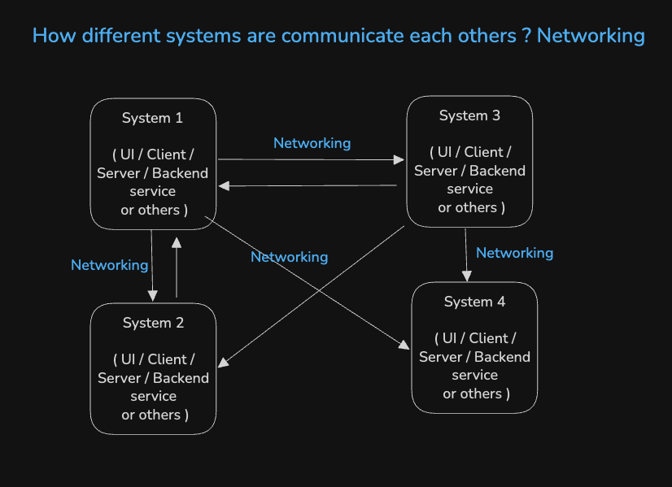

# 1 - Networking Akshay & Chirag's Experience

> Akshay and Chirag are sharing their experience on Networking.

## 1. Different aspects of networking, related to frontend

## 2. How frontend systems communicate to backend systems

## 3. How different systems communicate with each others

- Why do we need networking ?

  - To connect one system to another system
  - Example: When client web apps request to API to get data, what ever things happen between UI & Backend is networking

  

## 4. Popular Interview Questions

- Networking Fundamentals
- How the Internet works
- Frontend-Backend Interaction in depth
- REST Concepts
- Difference between HTTP methods (GET, PUT, POST, DELETE)
- HTTP Header Based question and content type
- CORS in depth

## 5. While giving interviews, use the example to explain the concepts

## 6. For Senior devs, during interview add justification for why & how do you use ?
