# How API & Internet Works

- Ref: [System Design Crash Course — How API Works | DNS, TCP, TLS, Firewall, Gateway, Load Balancer](https://www.youtube.com/watch?v=zZGcasTtLfA) by **Mohit Chhabra**

---

## What is an API?

> **Definition:** API (Application Programming Interface) is a contract through which the client and server interact. It defines how requests are made and responses are returned.

**Purpose:** APIs allow the client (mobile app, browser) to communicate with the server to fetch or store data without exposing the server's internal logic.

**Types of APIs:** REST (most common), GraphQL, gRPC, SOAP

### Request & Response

- **Request** — what the client sends to the server (input)
- **Response** — what the server sends back to the client (output)
- **Format** — most APIs use **JSON** for both request and response

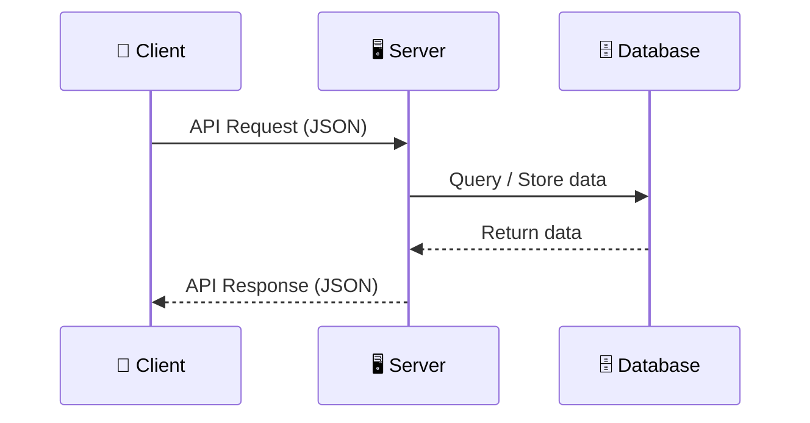

### API Request Structure

| Part              | Description                                      | Example                        |
| ----------------- | ------------------------------------------------ | ------------------------------ |
| **Method**        | HTTP verb (GET, POST, PUT, PATCH, DELETE)         | `GET`                          |
| **URL / Path**    | Endpoint path on the server                      | `/v1/users/123`                |
| **Host**          | Domain name of the server                        | `api.example.com`              |
| **Headers**       | Metadata (auth token, content type, user agent)  | `Authorization: Bearer <JWT>`  |
| **Body**          | Data payload (only for POST, PUT, PATCH)         | `{ "name": "John" }`          |
| **Protocol**      | HTTP version                                     | `HTTP/1.1`                     |

### API Response Structure

| Part              | Description                                      | Example                        |
| ----------------- | ------------------------------------------------ | ------------------------------ |
| **Status Code**   | Indicates success or failure                     | `200 OK`, `404 Not Found`      |
| **Headers**       | Metadata (content type, cache control)           | `Content-Type: application/json` |
| **Body**          | Response data in JSON                            | `{ "id": 123, "name": "John" }` |

---

## How DNS Works

> **Definition:** DNS (Domain Name System) is the phonebook of the internet. It translates human-readable domain names (like `youtube.com`) into IP addresses (like `172.217.27.164`) that the internet understands.

**Purpose:** Humans remember names, but the internet communicates using IP addresses. DNS bridges this gap.

### DNS Resolution Steps

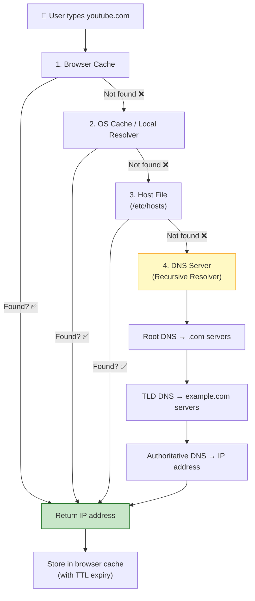

**Step-by-step:**

1. **Browser Cache** — check if the IP was recently looked up
2. **OS Cache / Local Resolver** — operating system level DNS cache
3. **Host File** — local override file (`/etc/hosts` on Linux/Mac)
4. **DNS Server (Recursive Resolver)** — queries the DNS hierarchy:
   - **Root DNS** → finds `.com` servers
   - **TLD (Top Level Domain) DNS** → finds `example.com` servers
   - **Authoritative DNS** → returns the actual IP address

### Real-time Example

When you type `www.google.com` in your browser:

1. Browser checks its cache — not found
2. OS checks local cache — not found
3. Query goes to Google DNS (`8.8.8.8`) or your ISP's DNS
4. DNS resolves `google.com` → `172.217.27.164`
5. Browser caches the result with a TTL (e.g., 5 minutes)
6. Next visit within TTL → instant resolution from cache

### DNS is Distributed

DNS is not a single server — it's a **distributed system with thousands of servers worldwide**.

- **Anycast** routing directs your query to the **nearest DNS server**
- User in India → DNS in Singapore; User in London → DNS in London
- If one DNS server goes down, traffic is rerouted to the next nearest

### Who Provides & Pays for DNS?

| Layer                      | Who Uses It        | Examples                           | Cost          |
| -------------------------- | ------------------ | ---------------------------------- | ------------- |
| **Public DNS Resolvers**   | End users          | Google DNS (8.8.8.8), Cloudflare (1.1.1.1) | Free          |
| **Authoritative DNS**      | Domain owners      | AWS Route 53, Cloudflare, GoDaddy | Paid (yearly) |
| **Root & TLD DNS**         | Global infra       | Managed by ICANN, regional authorities | Funded by domain registration fees |

---

## TCP — Transmission Control Protocol

> **Definition:** TCP is a transport layer protocol that establishes a reliable connection between client and server before any data is transferred, using a three-way handshake.

**Purpose:** Ensures data delivery is **reliable** (no packet loss), **ordered** (packets arrive in sequence), and **error-checked** (corrupted packets are resent).

### TCP Three-Way Handshake

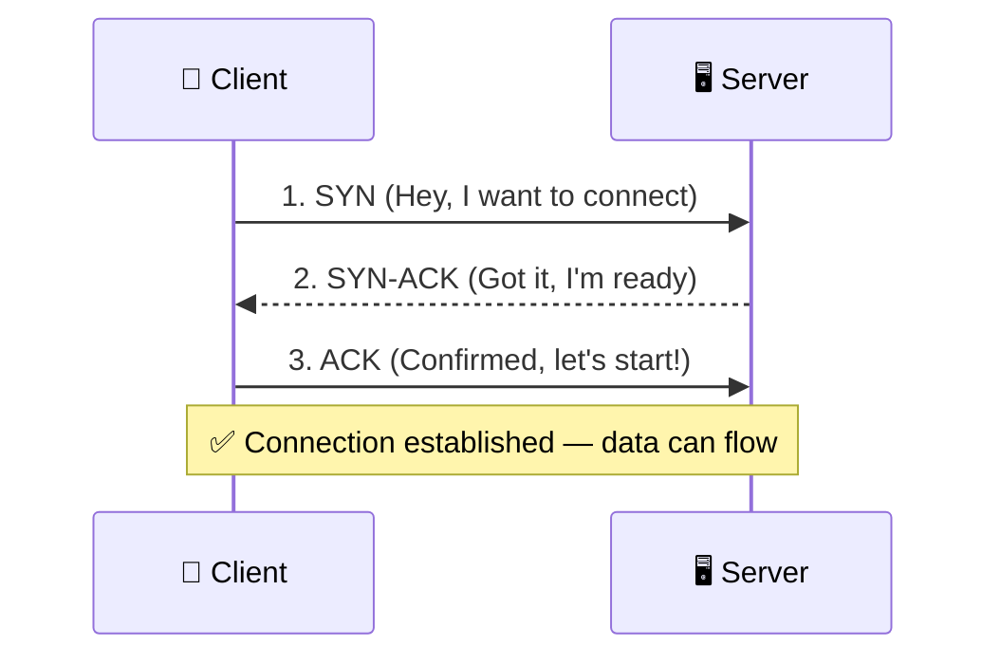

### TCP Connection Closing

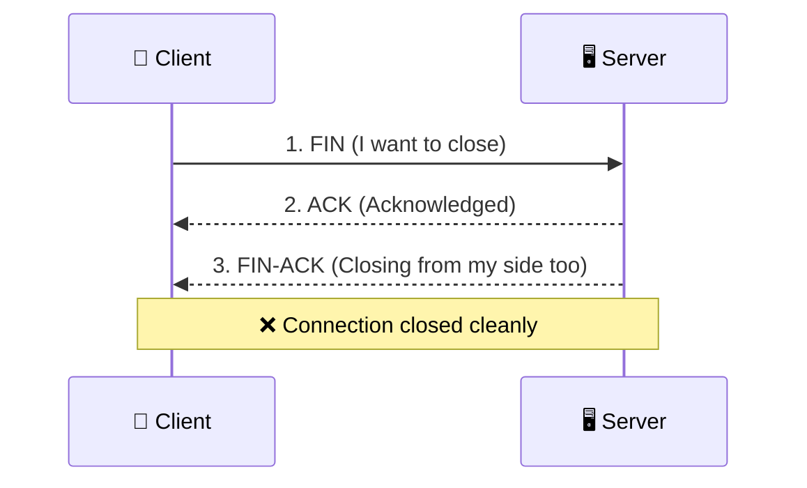

### TCP vs UDP

| Aspect          | TCP                                  | UDP                                   |
| --------------- | ------------------------------------ | ------------------------------------- |
| **Connection**  | Connection-oriented (handshake)      | Connectionless (no handshake)         |
| **Reliability** | Reliable — no packet loss            | Unreliable — packets can be lost      |
| **Order**       | Ordered delivery guaranteed          | No ordering guarantee                 |
| **Speed**       | Slower (due to handshake overhead)   | Faster (no connection setup)          |
| **Use case**    | APIs, web browsing, file transfer    | Video calls, live streaming, gaming   |

### Do We Need a New TCP for Every Request?

| HTTP Version | Behavior                                                          |
| ------------ | ----------------------------------------------------------------- |
| **HTTP/1.0** | New TCP connection for every request (slow, inefficient)          |
| **HTTP/1.1** | **Keep-alive** — reuse connection for multiple sequential requests |
| **HTTP/2**   | **Multiplexing** — multiple parallel requests on one connection   |
| **HTTP/3**   | Uses **QUIC over UDP** — eliminates TCP handshake entirely        |

---

## TLS — Transport Layer Security

> **Definition:** TLS (Transport Layer Security) is a cryptographic protocol that provides encryption, authentication, and data integrity for communication over the internet. It's the "S" in HTTPS.

**Purpose:** Ensures that:

- **Encryption** — nobody can read your data in transit
- **Authentication** — you're talking to the real server, not an imposter
- **Integrity** — data is not tampered with during transit

### TLS Handshake (Simplified)

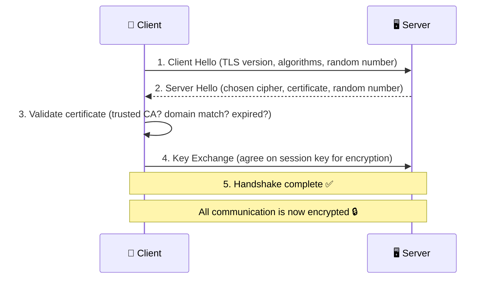

### HTTP vs HTTPS

| Aspect        | HTTP                          | HTTPS                                |
| ------------- | ----------------------------- | ------------------------------------ |
| **Encryption**| None — data is plaintext      | Encrypted via TLS                    |
| **Security**  | Vulnerable to man-in-middle   | Secure — encrypted + authenticated   |
| **Port**      | 80                            | 443                                  |
| **Speed**     | Slightly faster               | TLS 1.3 makes HTTPS nearly as fast   |

### TLS 1.2 vs TLS 1.3

| Aspect            | TLS 1.2                    | TLS 1.3                    |
| ----------------- | -------------------------- | -------------------------- |
| **Round trips**   | 2 round trips              | 1 round trip               |
| **Speed**         | Slower                     | Faster                     |
| **Security**      | Good                       | Stronger forward secrecy   |
| **Standard today**| Legacy                     | Modern standard            |

### Real-time Example

When you visit `https://google.com`:

1. TCP connection is established (3-way handshake)
2. TLS handshake encrypts the channel
3. Your search query is encrypted before sending
4. Google's response is encrypted before returning
5. Nobody in between (ISP, Wi-Fi hackers) can read your data

---

## IPv4 vs IPv6

> **Definition:** IP addresses are unique numerical identifiers assigned to every device connected to the internet.

| Aspect          | IPv4                              | IPv6                                      |
| --------------- | --------------------------------- | ----------------------------------------- |
| **Format**      | `192.168.0.1` (dotted decimal)    | `2405:0204:0067:...` (hexadecimal colons) |
| **Bits**        | 32-bit                            | 128-bit                                   |
| **Total IPs**   | ~4.3 billion                      | Virtually unlimited                       |
| **Range**       | Each octet: 0–255                 | Each group: 0000–FFFF                     |
| **NAT needed?** | Yes (not enough IPs)              | No (each device gets a unique IP)         |
| **Adoption**    | Still widely used                 | Growing                                   |

---

## How Packets Travel Across the Internet

> **Definition:** When you send an API request, the data is broken into packets that travel through multiple network hops (routers, ISPs, undersea cables) to reach the destination server.

**Simplified path (India → US server):**

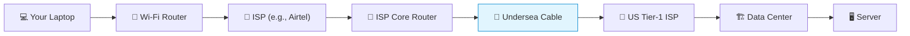

**Key protocols:**

- **BGP (Border Gateway Protocol)** — connects different ISPs and data centers globally; reroutes if a path goes down
- **OSPF (Open Shortest Path First)** — finds the shortest route within an ISP's own network

---

## Firewall

> **Definition:** A firewall is a network security device (hardware or software) that monitors and filters incoming/outgoing traffic based on predefined security rules. It operates at the **L3 (Network) / L4 (Transport)** layer.

**Purpose:** Block bad or unauthorized traffic **before** it reaches your infrastructure (gateway, load balancer, servers, database).

### What Firewall Blocks

- Requests from **blacklisted IP ranges**
- Requests with **malformed headers**
- Traffic from **unauthorized regions** (if your app is region-specific)
- **DDoS attack** traffic

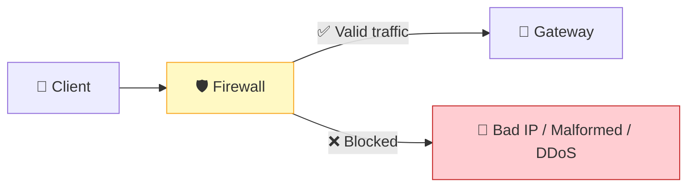

---

## Gateway

> **Definition:** A gateway is a networking component that acts as an entry point to your internal system. It can operate at **L3 (Network)** level for network translation or **L7 (Application)** level for API routing, authentication, and rate limiting.

**Purpose:** It connects the external public internet to your internal private network, and enforces security policies before requests reach your microservices.

### L3 Gateway (Network Level)

- Connects **public internet** to **private internal network**
- Handles **NAT** (Network Address Translation) — public IP ↔ private IP

### L7 Gateway / API Gateway (Application Level)

Three major responsibilities:

**1. Authentication** — validates the JWT token to verify the user

**2. Rate Limiting** — limits requests per client (e.g., 1000 req/sec). Returns `429 Too Many Requests` if exceeded.

**3. Routing** — forwards the request to the correct microservice based on the URL path

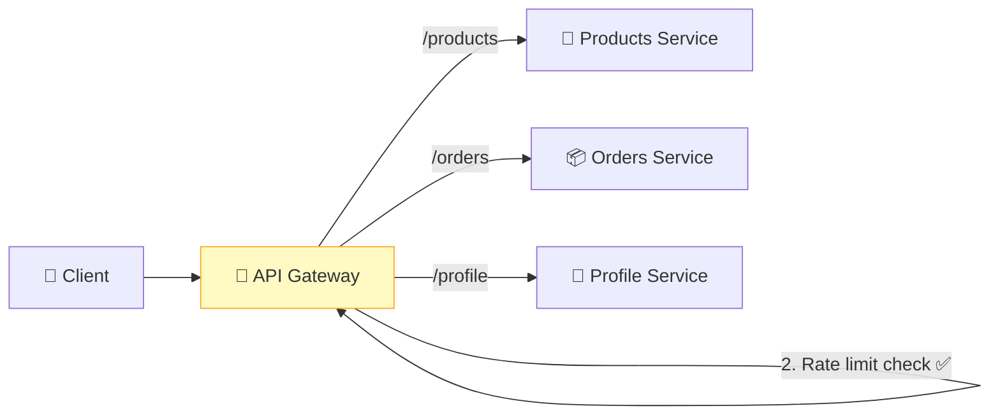

### L3 vs L7 Gateway

| Aspect          | L3 Gateway (Network)              | L7 Gateway (Application)                   |
| --------------- | --------------------------------- | ------------------------------------------- |
| **OSI Layer**   | Layer 3 (Network)                 | Layer 7 (Application)                       |
| **Inspects**    | IP addresses only                 | URLs, headers, payloads, JWT tokens         |
| **Routing**     | Based on IP source/destination    | Based on URL path, host, query params       |
| **Features**    | NAT, public ↔ private network     | Auth, rate limiting, routing to microservices |
| **Type**        | Usually hardware                  | Usually software (Nginx, AWS API Gateway)   |

---

## Load Balancer

> **Definition:** A load balancer is a networking component that distributes incoming requests evenly across multiple servers so that no single server gets overwhelmed. It can operate at **L4 (Transport)** or **L7 (Application)** layer.

**Purpose:** Ensures even distribution of traffic across servers, performs health checks, and reroutes traffic away from failed servers.

### How it Works

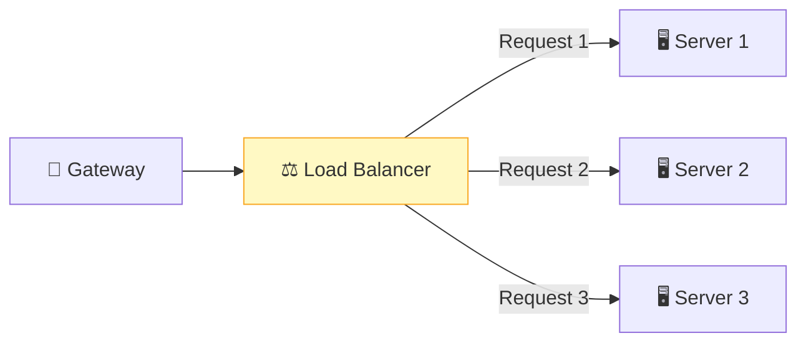

### Load Balancing Techniques

| Technique              | How it Works                                                |
| ---------------------- | ----------------------------------------------------------- |
| **Round Robin**        | Requests go to servers one by one in order (1→2→3→1→2→3...) |
| **Least Connections**  | Send to the server with the fewest active connections        |
| **Weighted Routing**   | Servers with higher capacity get more requests               |
| **Consistent Hashing** | Hash-based assignment — same client goes to same server (L7) |

### L4 vs L7 Load Balancer

| Aspect          | L4 Load Balancer (Transport)     | L7 Load Balancer (Application)            |
| --------------- | -------------------------------- | ----------------------------------------- |
| **OSI Layer**   | Layer 4 (Transport)              | Layer 7 (Application)                     |
| **Inspects**    | IP address, ports, basic headers | HTTP headers, URLs, payloads              |
| **Routing**     | Connection-based (round robin)   | Content-based (consistent hashing)        |
| **Use case**    | Distribute across L7 gateways    | Distribute across servers in a microservice |

### Responsibilities

- Distribute requests across healthy servers
- **Health checks** — continuously monitor which servers are alive
- **Failover** — if a server crashes, redirect traffic to others
- Enables **horizontal scaling** — more servers = more capacity

---

## Gateway vs Load Balancer

| Aspect              | Gateway                                        | Load Balancer                              |
| ------------------- | ---------------------------------------------- | ------------------------------------------ |
| **Primary role**    | Security, auth, rate limiting, routing          | Distribute load across servers             |
| **Authentication**  | Yes (JWT validation)                           | No                                         |
| **Rate limiting**   | Yes                                            | No                                         |
| **Routing**         | Routes to correct microservice                 | Routes to a specific server within a service |
| **Protocol translation** | Yes (WebSocket ↔ REST)                   | No                                         |
| **Scope**           | Connects external internet to internal network | Balances load within internal network      |

---

## Complete API Flow — End to End

Here's the complete journey of an API request from your browser to the server and back:

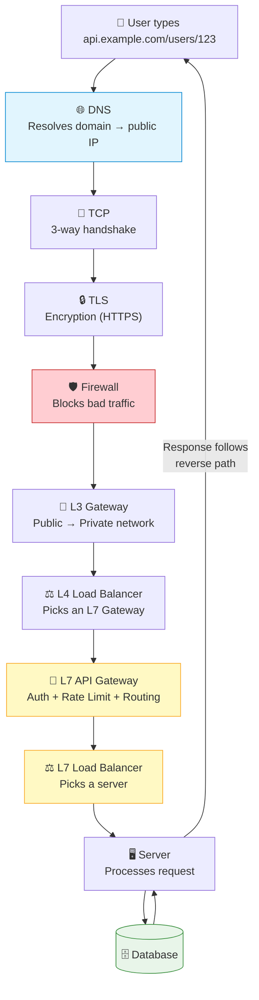

### Simplified Flow (For Interviews)

In system design interviews, you can simplify to:

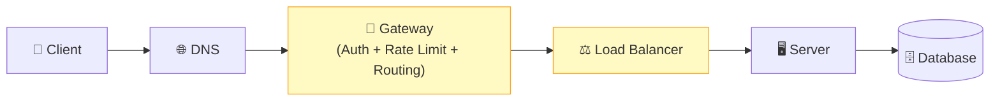

> TCP/TLS and Firewall are implied. Focus on Gateway (auth, rate limiting, routing) and Load Balancer (distribute traffic).

---

## Reverse Proxy — How Responses Travel Back

> **Definition:** In a reverse proxy model, the response follows the exact reverse path of the request. The client never communicates directly with the microservice.

**Purpose:** Ensures security, consistency, and centralized control. The client remains unaware of internal infrastructure.

### Key Concept: Hop-by-Hop Connections

Each component creates a **separate TCP connection** to the next component. They are not the same connection.

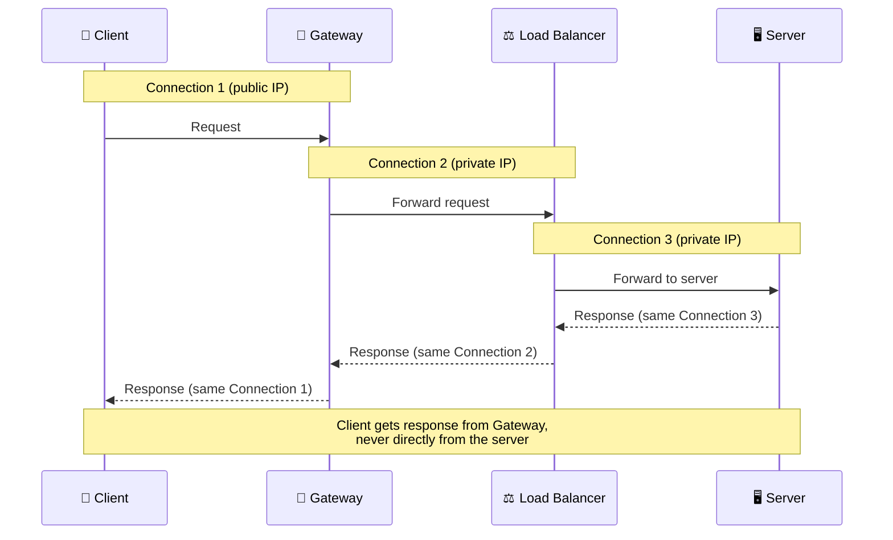

Each component maintains an **internal mapping** of connection IDs so the response can trace back the exact path the request took.

---

## Public IP vs Private IP

> **Definition:** Public IPs are accessible from the external internet. Private IPs are only accessible within the internal network.

| Aspect            | Public IP                              | Private IP                                |
| ----------------- | -------------------------------------- | ----------------------------------------- |
| **Accessible from** | Anywhere on the internet             | Only within the internal network          |
| **Assigned to**   | Firewall / Gateway (first infra layer) | Microservices, servers, load balancers    |
| **DNS returns**   | Public IP of gateway                   | Never exposed to clients                  |
| **Security**      | Exposed — needs firewall protection    | Hidden — not reachable from outside       |

:::tip Key Principle
The client **never** interacts directly with microservices. DNS returns the **public IP of the gateway/firewall**. All internal servers have **private IPs** that are invisible to the outside world.
:::

---

## OSI Model Reference (7 Layers)

| Layer | Name          | Components at this Layer                |
| ----- | ------------- | --------------------------------------- |
| L7    | Application   | L7 Gateway (API Gateway), L7 Load Balancer |
| L6    | Presentation  | —                                       |
| L5    | Session       | —                                       |
| L4    | Transport     | TCP, UDP, L4 Load Balancer, Firewall    |
| L3    | Network       | IP, L3 Gateway, Firewall               |
| L2    | Data Link     | —                                       |
| L1    | Physical      | —                                       |

---

## Do You Always Need All Components?

| Scale                | Components Needed                                        |
| -------------------- | -------------------------------------------------------- |
| **Small / Dev setup** | Server + Database (that's it)                           |
| **Multiple servers** | + Load Balancer                                          |
| **Multiple microservices** | + Gateway (auth, rate limiting, routing)           |
| **Production at scale** | + Firewall + L3 Gateway + L4 LB + L7 Gateway + L7 LB |

:::tip For Interviews
Always include **Gateway** and **Load Balancer** in your system design diagrams. Mention that Gateway handles auth, rate limiting, and routing. Load Balancer distributes traffic. Firewall and L3/L4 layers can be mentioned briefly.
:::

---

## Summary

| Concept              | One-Line Definition                                                              |
| -------------------- | -------------------------------------------------------------------------------- |
| **API**              | Contract through which client and server interact using request/response         |
| **DNS**              | Phonebook of the internet — translates domain names to IP addresses              |
| **TCP**              | Reliable transport protocol — 3-way handshake before data transfer               |
| **TLS**              | Encryption protocol — provides HTTPS security (encryption + auth + integrity)    |
| **IPv4 vs IPv6**     | 32-bit (4.3B addresses) vs 128-bit (virtually unlimited) IP addressing           |
| **Firewall**         | Blocks bad traffic at the network level before it reaches your infra             |
| **L3 Gateway**       | Connects public internet to private internal network (NAT)                       |
| **L7 API Gateway**   | Auth + rate limiting + routing requests to correct microservice                  |
| **L4 Load Balancer** | Distributes traffic across L7 gateways based on IP/port                          |
| **L7 Load Balancer** | Distributes traffic across servers within a microservice (consistent hashing)    |
| **Reverse Proxy**    | Response follows the exact reverse path of the request — hop-by-hop connections  |
| **Public vs Private IP** | Gateway has public IP (DNS returns this); servers have private IPs (hidden)  |
