# System Design Basics

- Ref: [System Design Basics | Client, Server, API, Database, Cache, Load Balancer, Monolith vs Microservice](https://www.youtube.com/watch?v=jq2XHMQwCUE) by **Mohit Chhabra**

---

## What is System Design?

**Purpose:** System design is the process of defining the architecture, components, and interactions of a system to satisfy specific requirements. It answers the question — *"How do we build a software system that works reliably at scale?"*

At a high level, system design deals with:

- How different parts of a system communicate with each other
- How data flows from the user to the server and back
- How to handle millions of users without the system crashing
- How to make sure the system stays available even when parts of it fail

### Real-time Example

Think about **YouTube** — when you open the app and tap on a video, a lot happens behind the scenes: your request travels to a server, the server fetches the video data from a database, and streams it back to your device. System design is the blueprint that makes all of this work smoothly for billions of users simultaneously.

---

## Client and Server

### What is a Client?

**Purpose:** A client is the platform or medium through which an end user interacts with a product.

- A **mobile app** (Android / iOS) running YouTube
- A **web browser** (Chrome, Safari) where you type `www.youtube.com`
- A **smart TV** app

All of these are clients — they are the *front door* through which users access a service.

### What is a Server?

**Purpose:** A server is a machine (or set of machines) that contains the business logic and processes requests from clients.

In simple terms, if you write a piece of code on your laptop that takes an input image and returns a filtered version of it — your laptop is acting as a server.

### Real-time Example — Restaurant Analogy

| Restaurant        | Technical Equivalent |
| ----------------- | -------------------- |
| You (the customer) | Client               |
| Chef               | Server               |
| Waiter             | API                  |
| Kitchen            | Database             |
| Salt/pepper nearby | Cache                |

You don't walk into the kitchen and talk to the chef directly. You tell the **waiter** what you want, the waiter relays it to the chef, and the chef prepares your order and sends it back through the waiter.

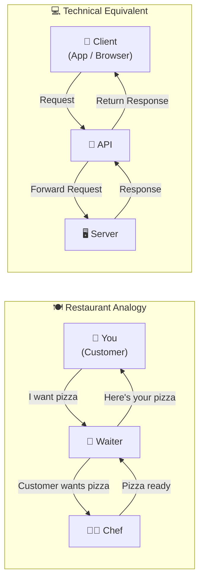

---

## API — Application Programming Interface

**Purpose:** An API is the intermediary (the "waiter") that allows the client and server to communicate without the client needing to know how the server works internally.

### How it Works

1. **Client** sends a **request** to the API (e.g., "I want to watch this video")
2. The **API** forwards the request to the **server**
3. The **server** processes the request and prepares a **response**
4. The **API** sends the response back to the **client**

In technical terms, we call the input a **request** and the output a **response**.

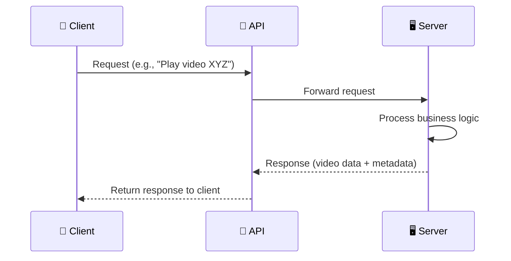

### Real-time Example

When you click on a video thumbnail on YouTube:

1. The front-end code detects the click event
2. It fires an API request to YouTube's server with the video ID
3. The server fetches the video data and metadata
4. The API returns the video stream and details back to your browser/app

> The end user never knows an API exists — they just click a button. The front-end developers write code that triggers API calls on user interactions.

---

## Frontend and Backend

### Frontend

**Purpose:** The frontend is the user-facing part of the product — everything the user can see and interact with.

- Built using **Swift** (iOS), **Kotlin/Java** (Android), **JavaScript/HTML/CSS** (Web)
- Handles UI rendering, button clicks, navigation
- Triggers API calls when the user performs actions

### Backend

**Purpose:** The backend is the server-side logic that the user never directly interacts with. It processes requests, applies business logic, and returns results.

- Built using **Java**, **Node.js**, **Python**, **PHP**, **Go**, etc.
- Contains the core business logic (e.g., applying AI filters to an image, sorting a feed, processing payments)

### Real-time Example

Think of a **car**:

- **Frontend** = Steering wheel, brakes, dashboard — things you see and interact with
- **Backend** = Engine, transmission, braking mechanism — how things actually work under the hood

You press the brake (frontend interaction), and the car stops (backend logic). You don't need to understand hydraulic braking systems to drive.

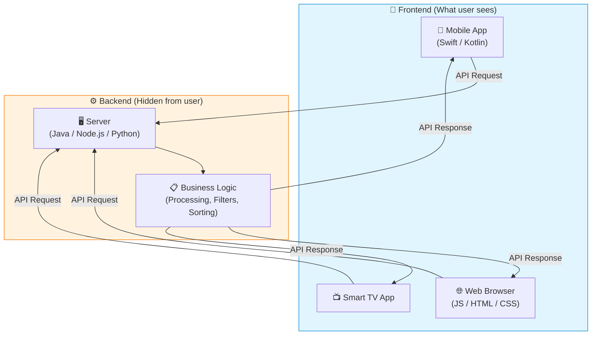

---

## Database

**Purpose:** A database is where all the data required by your application is stored persistently. Just like a kitchen stores all the raw ingredients needed to prepare dishes, a database stores all the data the server needs to generate responses.

### How it Fits in the Flow

1. Client sends a request via API
2. Server receives the request
3. Server queries the **database** to fetch the required data
4. Server processes the data (applies business logic)
5. Server sends the response back via API

### Real-time Example

On YouTube, every video, thumbnail, title, description, like count, and comment is stored in databases. When you open a channel page, the server queries the database to fetch all 277 videos and their metadata, then returns the relevant data to your client.

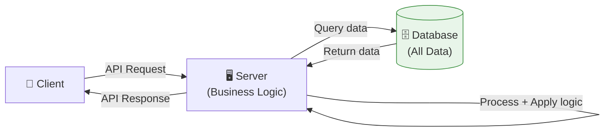

---

## Cache

**Purpose:** A cache is a fast, temporary storage layer that holds frequently accessed data so the server doesn't have to query the slower database every time.

### Why Cache?

- **Speed**: Cache stores data in memory (RAM), which is significantly faster than disk-based database reads
- **Reduced database load**: Frequently requested data is served from cache, reducing pressure on the database
- **Trade-off**: Cache has limited storage (RAM is expensive) — only the most frequently used data is kept here

### Cache Hit vs Cache Miss

| Scenario        | What Happens                                                                 | Analogy                                              |
| --------------- | ---------------------------------------------------------------------------- | ---------------------------------------------------- |
| **Cache Hit**   | Data is found in the cache → served directly, very fast                      | Salt is right in front of the chef — grab and use    |
| **Cache Miss**  | Data is NOT in the cache → fetched from database, stored in cache for next time | Salt ran out — go to kitchen, refill, then use       |

### Real-time Example

When **Ronaldo posts on Instagram**, millions of people will view it within minutes. Instead of hitting the database for every single request, Instagram caches that post. Every subsequent viewer gets it from the cache (cache hit) — making it blazing fast.

Similarly, after a **FIFA World Cup final**, the highlights video is cached because the system knows it will be accessed millions of times.

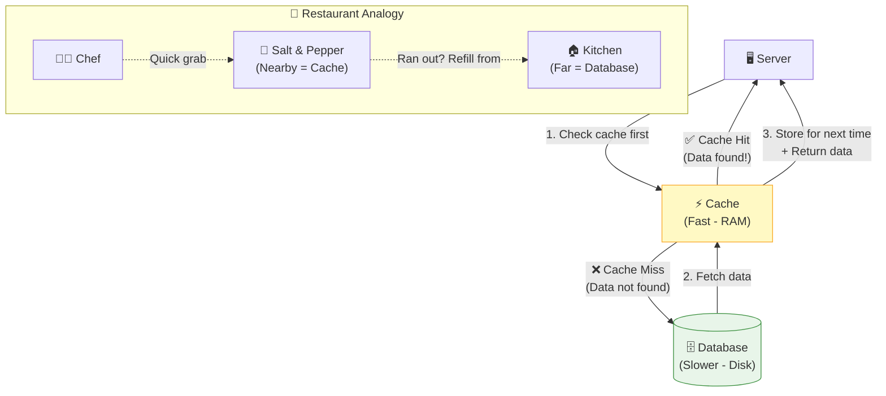

---

## Scaling — Vertical vs Horizontal

**Purpose:** Scaling is the process of increasing your system's capacity to handle growing traffic and load.

### Vertical Scaling (Scale Up)

Increase the power of your **existing** machine.

- Add more RAM (8GB → 16GB)
- Upgrade to SSD storage
- Add a better CPU or GPU

**Analogy:** You have one chef — you increase his salary so he works longer hours.

**Analogy 2:** You have a restaurant on the ground floor — you rent out the first floor in the **same building** to seat more customers.

### Horizontal Scaling (Scale Out)

Add **more machines** to distribute the load.

- Instead of one powerful server, use 5 servers working together

**Analogy:** Instead of overworking one chef, you hire 4 more chefs.

**Analogy 2:** Instead of adding floors to the same building, you open a **new restaurant in another location**.

### Comparison

| Aspect                  | Vertical Scaling                          | Horizontal Scaling                              |
| ----------------------- | ----------------------------------------- | ----------------------------------------------- |
| **Approach**            | Upgrade existing machine                  | Add more machines                               |
| **Ease**                | Simple — just upgrade hardware            | Complex — manage multiple machines              |
| **Communication**       | Fast (inter-process, local)               | Slower (network calls between machines)         |
| **Limit**               | Has a ceiling (max hardware capacity)     | Virtually unlimited                             |
| **Single Point of Failure** | Yes — one machine goes down, system is down | No — other machines continue working        |
| **Cost**                | Expensive at high end                     | More cost-effective at scale                    |

### Real-time Example

**WhatsApp** handles millions of messages daily. A single server, no matter how powerful, cannot handle that. WhatsApp uses **horizontal scaling** — hundreds of servers distributed across data centers worldwide. If one server goes down, others pick up the load seamlessly.

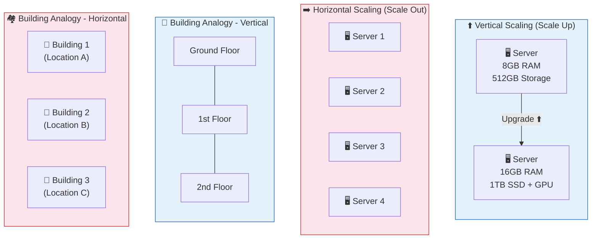

---

## Single Point of Failure (SPOF)

**Purpose:** A single point of failure is any component in your system where, if it fails, the **entire system goes down**. Good system design eliminates SPOFs.

### Why it Matters

- If you have only **one server** and it crashes → your entire product is offline
- If you have only **one database** and it corrupts → all your data is inaccessible

### How to Avoid SPOF

Use **horizontal scaling** and **replication**:

- Multiple servers so if one fails, others handle the traffic
- Multiple database replicas so data is never lost
- Distribute resources across **different geographic regions** so a natural disaster in one area doesn't take down the whole system

### Real-time Example

Major companies like **Netflix** deploy their servers across multiple AWS regions worldwide. If the US-East data center goes down, US-West or EU servers continue serving users. This is why Netflix rarely has a complete global outage.

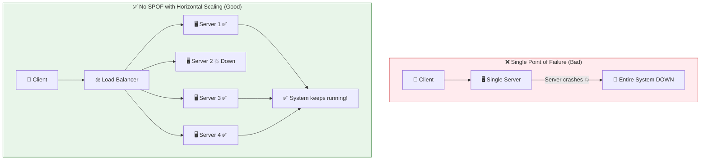

---

## Auto-Scaling

**Purpose:** Auto-scaling automatically adjusts the number of servers based on current traffic load — scaling up during peak times and scaling down during low traffic to save costs.

### How it Works

Cloud providers like **AWS**, **Google Cloud**, and **Azure** offer auto-scaling:

- During a **flash sale** on an e-commerce site, traffic spikes 10x → auto-scaling adds more servers
- At 3 AM when traffic is minimal → auto-scaling removes extra servers to reduce cost

### Real-time Example

During **Amazon Prime Day**, traffic surges massively. AWS auto-scaling detects the increased load and spins up hundreds of additional servers automatically. Once the sale ends and traffic normalizes, those extra servers are decommissioned. The business only pays for what it uses.

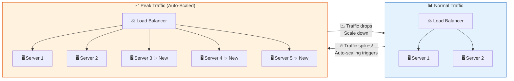

---

## Load Balancer

**Purpose:** A load balancer distributes incoming API requests evenly across multiple servers so that no single server gets overwhelmed.

### Why is it Needed?

Without a load balancer, all requests might hit **Server 1** while **Server 2, 3, 4** sit idle. This defeats the purpose of horizontal scaling.

### How it Works

1. Client sends a request via API
2. The request first reaches the **load balancer**
3. The load balancer decides which server should handle this request (using algorithms like **consistent hashing**, **round-robin**, etc.)
4. The selected server processes the request and returns the response

**Analogy:** The load balancer is like a **kitchen manager** who assigns orders to chefs. The waiter (API) just tells the kitchen manager what's needed, and the kitchen manager decides which chef (server) handles it — ensuring all chefs are equally busy.

### Real-time Example

When you search on **Google**, your request hits a load balancer first. Google has thousands of servers worldwide. The load balancer routes your request to the nearest, least-loaded server — which is why Google Search responds in milliseconds regardless of how many people are searching simultaneously.

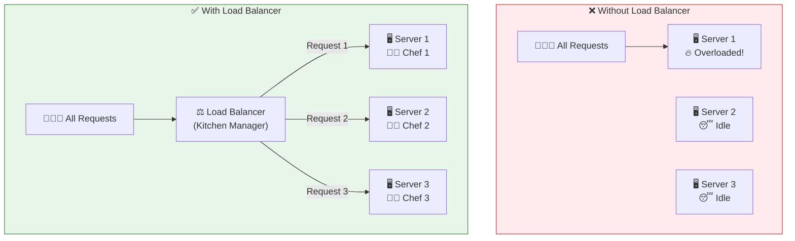

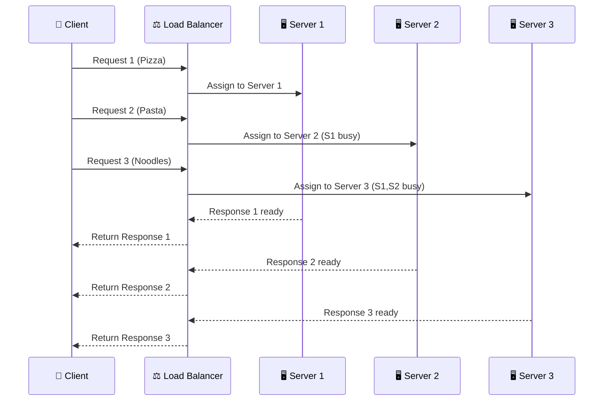

---

## Synchronous vs Asynchronous Communication

### Synchronous (Sync)

**Purpose:** The client sends a request and **waits (blocks)** until it gets a response. Nothing else can happen in the meantime.

**Analogy:** You stand in a pizza queue, place your order, and **must wait in line** until your pizza is ready. You can't leave or do anything else.

### Asynchronous (Async)

**Purpose:** The client sends a request and is **immediately free** to do other things. It gets notified when the response is ready.

**Analogy:** You place your order, receive a **token number (e.g., #20)**, and go sit down or browse your phone. When your pizza is ready, they call out "Order #20!" — you pick it up.

### Comparison

| Aspect        | Synchronous                        | Asynchronous                                 |
| ------------- | ---------------------------------- | -------------------------------------------- |
| **Client**    | Blocked, waiting                   | Free to do other tasks                       |
| **Speed**     | Slower (sequential processing)     | Faster (parallel processing possible)        |
| **Use case**  | Simple, immediate responses needed | Long-running tasks, background processing    |

### Real-time Example

When you **upload a video to YouTube**:

1. Your raw video file is uploaded (this part may feel sync — you wait for the upload bar)
2. Once uploaded, **you're free** — YouTube processes the video asynchronously in the background (encoding to multiple resolutions, copyright checks, thumbnail generation)
3. You get **notified** when processing is complete and the video is ready to publish

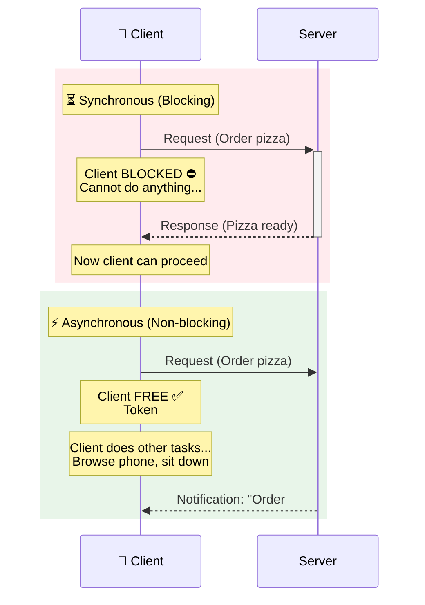

---

## Message Queue (e.g., Kafka, RabbitMQ)

**Purpose:** A message queue is a component that enables asynchronous processing by holding tasks in a queue until servers (consumers) are ready to process them.

### How it Works

1. Requests (messages/events) are added to the queue
2. Available servers (consumers) pick up tasks from the queue one at a time
3. Once a task is processed, it's removed from the queue
4. If all servers are busy, new tasks simply wait in the queue — no request is lost

**Analogy:** Think of a restaurant with 2 chefs and 50 orders. The orders are written on slips and placed in a queue. Each chef picks up the next slip when they finish their current dish. Customers don't wait at the counter — they gave their order and are free.

### Real-time Example

When you **send a message on WhatsApp** to someone who is offline, the message doesn't disappear. It's placed in a **message queue**. When the recipient comes online, the queue delivers the message. This is asynchronous processing powered by message queues.

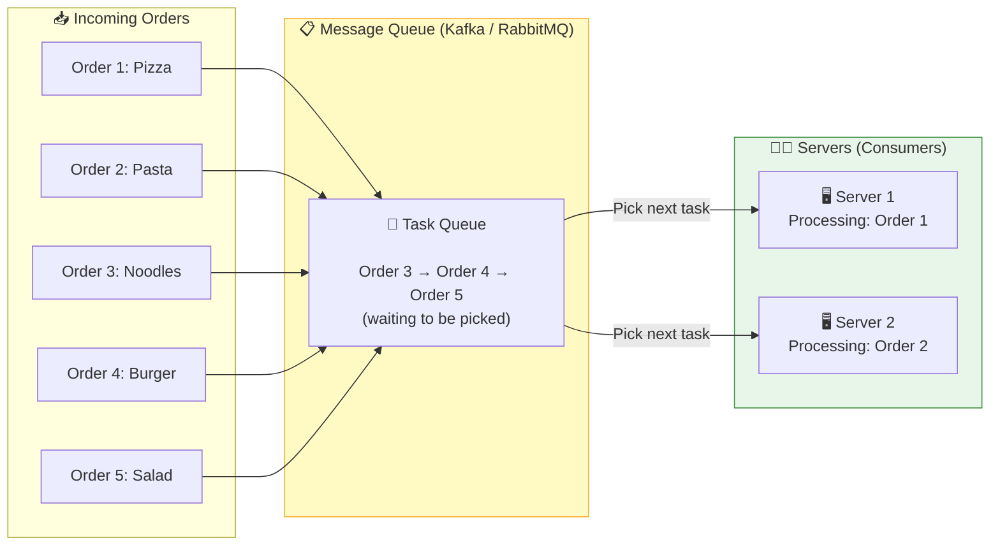

---

## Stateful vs Stateless Architecture

### Stateful

**Purpose:** The server maintains information (state) about the client across requests. The client's requests must always go to the **same server**.

**Problem:** If that specific server goes down, the client's session/data is lost — no other server knows about this client.

**Analogy:** You always go to the same concert staff member who knows you and gives you 10% off. One day he's absent — no one else recognizes you, and you can't get in.

### Stateless

**Purpose:** The server does NOT store any client state. Instead, the client sends all necessary identification (e.g., a **JWT token**) with every request. Any server can handle any request.

**Analogy:** Instead of relying on one staff member, you get a **membership card**. You show it to any staff member at the entrance, and they verify your identity and give you the discount.

### Why Stateless is Preferred

| Aspect                | Stateful                                  | Stateless                                   |
| --------------------- | ----------------------------------------- | ------------------------------------------- |
| **Server dependency** | Request tied to a specific server         | Request can go to any server                |
| **Horizontal scaling**| Limited — sticky sessions needed          | Works seamlessly with load balancers        |
| **Fault tolerance**   | Server failure = lost client state        | Server failure = no impact, others take over|
| **Scalability**       | Hard to scale                             | Easy to scale                               |

### Real-time Example

When you browse **Amazon.com**, your authentication token (JWT) is sent with every request. Whether your request lands on Server A in Virginia or Server B in Oregon, both can verify your identity and serve your personalized page. This is stateless architecture in action.

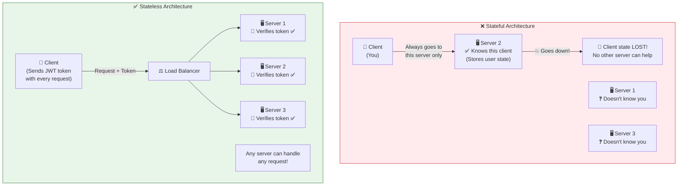

---

## Monolithic vs Microservices Architecture

### Monolithic Architecture

**Purpose:** The entire application is built and deployed as a **single unit**. All features — authentication, user feed, profile, orders — live in one codebase and run as one process.

**Analogy:** A single large room where customers, chefs, raw materials, and reception all operate together. Everything is interconnected.

**Pros:**

- Simple to develop and deploy when the system is small
- Easy inter-module communication (everything is in-process)
- Good for startups and MVPs

**Cons:**

- A bug in one module can crash the entire system
- Deploying a small change requires redeploying the whole application
- Hard to scale individual features independently
- As the codebase grows, it becomes harder to maintain

### Microservices Architecture

**Purpose:** The application is split into small, independent services, each responsible for a specific feature. Each service can be developed, deployed, and scaled independently.

**Analogy:** The same restaurant, but now the customer area, kitchen, and storage are **separate rooms** with their own entrances. A water leak in storage doesn't affect the dining area.

**Pros:**

- Independent deployment — update one service without touching others
- Independent scaling — scale the user-feed service more than the profile service if needed
- Fault isolation — if the orders service crashes, authentication and feed still work
- Technology flexibility — different services can use different tech stacks

**Cons:**

- More complex to set up and manage
- Network communication between services adds latency
- Requires robust monitoring and orchestration

### Comparison

| Aspect              | Monolithic                              | Microservices                                |
| ------------------- | --------------------------------------- | -------------------------------------------- |
| **Deployment**      | Deploy entire app at once               | Deploy individual services independently     |
| **Scaling**         | Scale the whole app                     | Scale individual services as needed          |
| **Fault impact**    | One failure can crash everything        | Failure is isolated to one service           |
| **Complexity**      | Simple initially, complex at scale      | Complex initially, manageable at scale       |
| **Best for**        | Small apps, startups, MVPs              | Large-scale, distributed systems             |

### Real-time Example

**Netflix** started as a monolithic application. As it grew to serve 200+ million users, they migrated to microservices. Now, the **recommendation engine**, **video streaming**, **user authentication**, **billing**, and **content catalog** are all separate microservices. If the recommendation engine has a bug, you can still stream videos — the streaming service is completely independent.

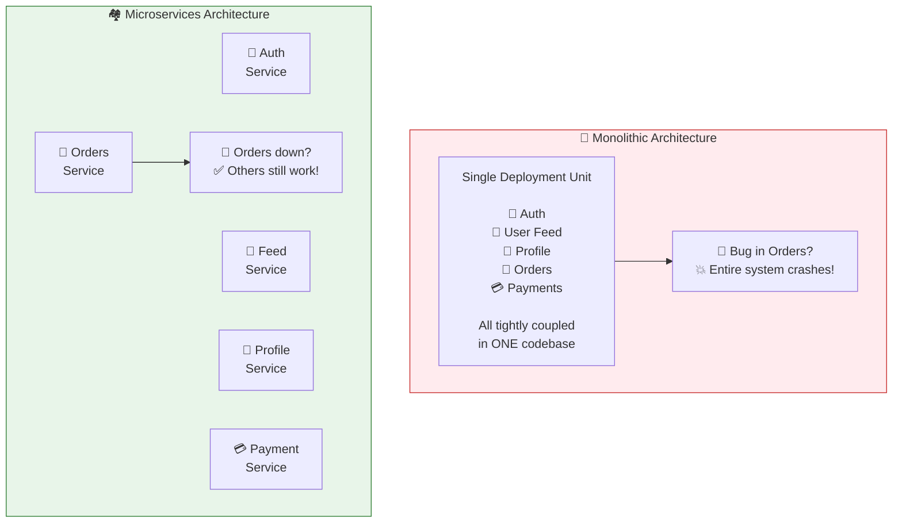

---

## Putting It All Together — Request Flow in a Real System

Here's how all the components work together when you open YouTube and play a video:

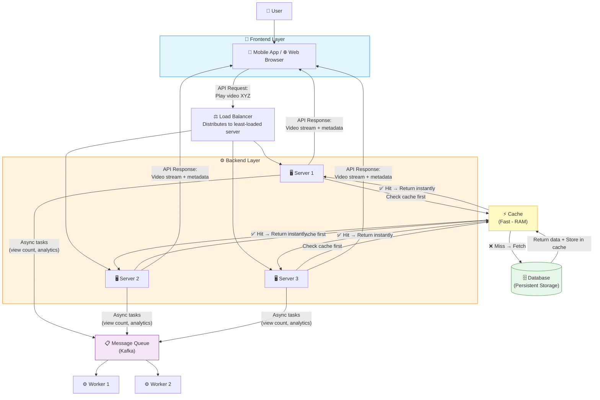

---

## Summary

| Concept              | One-Line Definition                                                        |
| -------------------- | -------------------------------------------------------------------------- |
| **Client**           | The platform (app/browser) through which users interact with the product   |
| **Server**           | Machine(s) running the business logic that processes requests              |
| **API**              | The intermediary that enables client-server communication                  |
| **Frontend**         | User-facing layer — what users see and interact with                       |
| **Backend**          | Server-side logic — how things actually work behind the scenes             |
| **Database**         | Persistent storage for all application data                                |
| **Cache**            | Fast temporary storage for frequently accessed data                        |
| **Vertical Scaling** | Upgrading the existing machine's resources                                 |
| **Horizontal Scaling** | Adding more machines to distribute load                                  |
| **SPOF**             | A component whose failure brings down the entire system                    |
| **Auto-Scaling**     | Automatically adjusting server count based on traffic                      |
| **Load Balancer**    | Distributes requests evenly across multiple servers                        |
| **Sync**             | Client waits (blocks) for the response                                     |
| **Async**            | Client is free after sending request; notified when response is ready      |
| **Message Queue**    | Holds tasks for async processing (e.g., Kafka, RabbitMQ)                  |
| **Stateful**         | Server stores client state — request tied to specific server               |
| **Stateless**        | Server stores no client state — any server can handle any request          |
| **Monolithic**       | Entire app as a single deployable unit                                     |
| **Microservices**    | App split into independent, separately deployable services                 |
